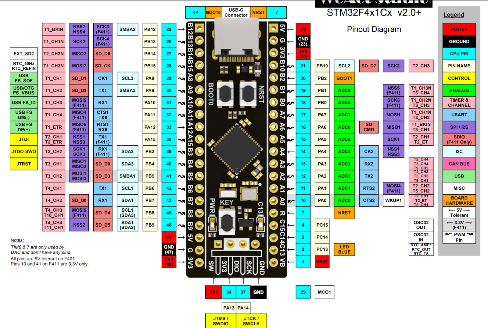

# External Peripherals Embedded System

## Descrição do Projeto

Este projeto tem como objetivo o desenvolvimento de um sistema embarcado simples que permita a comunicação entre um microcontrolador e uma aplicação externa para controlar periféricos. Através de uma interface serial, a aplicação externa pode enviar comandos para o sistema embarcado ler ou escrever em pinos de entrada e saída digitais, simulando o controle de dispositivos externos, como LEDs e chaves.

O microcontrolador utilizado no projeto é o **STM32F411 Blackpill**, que oferece uma série de pinos GPIO e suporte à comunicação serial, ideal para este tipo de aplicação.

## Problema

O problema proposto envolve o controle de periféricos através de um sistema embarcado, que deve ser capaz de:
- Ler o estado de pinos de entrada conectados a dispositivos externos (como chaves).
- Modificar o estado de pinos de saída conectados a periféricos (como LEDs).
- Comunicar-se com uma aplicação externa por meio de uma porta serial.
- Responder a comandos de leitura e escrita enviados pela aplicação, além de enviar notificações assíncronas ao detectar eventos em pinos de entrada.

Além disso, foi solicitado que a comunicação serial seguisse um protocolo específico, com tratamento para "byte-stuffing" e uso de delimitadores de quadros, visando garantir a integridade dos dados trocados.

## Abordagem

A solução foi desenvolvida em duas partes principais:
1. **Aplicação embarcada (firmware)**: Implementada no microcontrolador STM32F411 para controlar os pinos GPIO e se comunicar com a aplicação externa por meio da interface serial.
2. **Aplicação externa (host)**: Desenvolvida para enviar comandos ao sistema embarcado e receber as respostas ou notificações assíncronas.

### Funcionalidades principais:

- **Leitura e escrita de pinos**: A aplicação externa pode ler o estado de pinos de entrada (chaves) ou modificar o estado de pinos de saída (LEDs) no microcontrolador.
- **Eventos assíncronos**: A aplicação embarcada envia mensagens assíncronas quando um pino de entrada, configurado para monitorar mudanças de estado, detecta uma alteração (como a mudança de borda de um sinal digital).
- **Protocolo de comunicação**: As mensagens trocadas seguem um formato de quadro específico, com tratamento de bytes especiais através de "byte-stuffing", usando os delimitadores `0x7E` e o caractere de escape `0x7D`.

## Implementação

### 1. Aplicação Embarcada (main.c)
A aplicação embarcada é responsável por gerenciar os periféricos conectados ao microcontrolador STM32F411 Blackpill. Os principais componentes do código incluem:

- **Configuração de pinos GPIO**: Funções para configurar os pinos de entrada e saída, utilizando a biblioteca HAL da STM32.
- **Interrupções**: Configuração de interrupções externas para detectar mudanças nos pinos de entrada e gerar notificações assíncronas para a aplicação externa.
- **Processamento de comandos**: A função `process_command()` processa os comandos recebidos da aplicação externa, permitindo a leitura dos pinos de entrada e a escrita nos pinos de saída.
- **Protocolos de comunicação**: O firmware interpreta as mensagens recebidas pela interface serial, utilizando o protocolo de comunicação com delimitadores e "byte-stuffing".

### 2. Aplicação Externa (host_cmd.c e host_read.c)
A aplicação externa é responsável por enviar comandos ao sistema embarcado e interpretar as respostas.

- **host_cmd.c**: Responsável pelo envio de comandos de leitura e escrita para o sistema embarcado. O usuário pode interagir com a aplicação para enviar comandos que modificam o estado dos pinos GPIO ou configuram gatilhos nos pinos de entrada.
- **host_read.c**: Responsável pela leitura de dados enviados pela aplicação embarcada, processando notificações assíncronas ou respostas às requisições feitas pelo host.
- **Protocolo de comunicação**: Ambas as funções seguem o protocolo de comunicação implementado no sistema embarcado, incluindo o tratamento de "byte-stuffing" e a criação de quadros de dados corretos.

## Estrutura do Projeto

```bash
/ExternalPeripherals
│
├── stm32_baremetal_blackpill/  # Pasta contendo o código do firmware e Makefile para o STM32F411 Blackpill
│   ├── src/                    # 
│   │   ├── main.c              # Código principal do firmware embarcado
│   ├── Makefile                # Makefile para compilar o firmware
├── host_cmd.c                  # Código da aplicação externa para envio de comandos
├── host_read.c                 # Código da aplicação externa para leitura de dados
├── README.md                   # Descrição do projeto (este arquivo)
└── blackpill_pinout.jpg         # Imagem do pinout do STM32F411 Blackpill
```

## Como Executar

### 1. Compilação do Firmware
Para compilar o firmware embarcado, navegue até o diretório `ExternalPeripherals/stm32_baremetal_blackpill` e execute o comando:
```
make
```
Este comando gerará o binário do firmware que pode ser carregado no microcontrolador STM32F411 Blackpill através do comando:
```
make flash
```
Para estabelecer a conexão serial é necessária a instanciação da porta ACM0, o mesmo é feito utilizando o seguinte comando:
```
make serial
```
Após instanciada a porta é preciso executar o comando ```CTRL + C```, no mesmo terminal, para permitir a comunicação entre host e microcontrolador.

### 2. Execução da Aplicação Externa
A aplicação externa pode ser executada em qualquer máquina com uma conexão serial com o microcontrolador.

1. Compile os arquivos `host_cmd.c` e `host_read.c`:
```
gcc -o host_cmd host_cmd.c
gcc -o host_read host_read.c
```

2. Execute os binários gerados e siga as instruções fornecidas na interface de linha de comando para interagir com o sistema embarcado.

## Pinout do STM32F411 Blackpill

Abaixo está o pinout do microcontrolador STM32F411 Blackpill utilizado no projeto:



## Protocolos de Comunicação

A comunicação entre o sistema embarcado e a aplicação externa segue um formato de quadro definido da seguinte forma:

- **Delimitadores**: `0x7E` no início e no fim de cada quadro.
- **Byte-stuffing**: Se os bytes `0x7E` ou `0x7D` aparecerem na mensagem, eles são codificados com uma sequência de escape (`0x7D` seguido do byte XOR com `0x20`).

### Exemplo de Mensagem

Se a mensagem original for:

```
0xAA 0xBB 0xCC 0x7E 0x55 0x7D 0x23
```

Ela será transmitida como:

```
0x7E 0xAA 0xBB 0xCC 0x7D 0x5E 0x55 0x7D 0x5D 0x23 0x7E
```

## Requisitos

- Microcontrolador STM32F411 Blackpill
- Conexão serial com o host
- Ferramentas de compilação (GCC, make)
